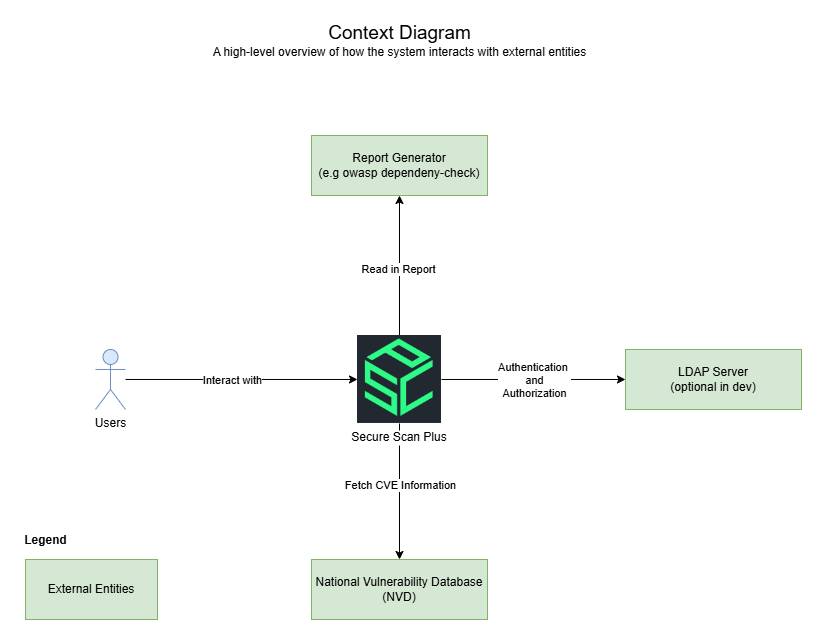
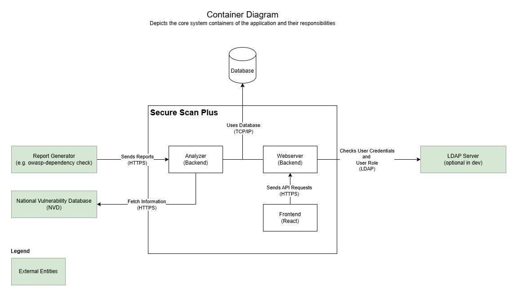
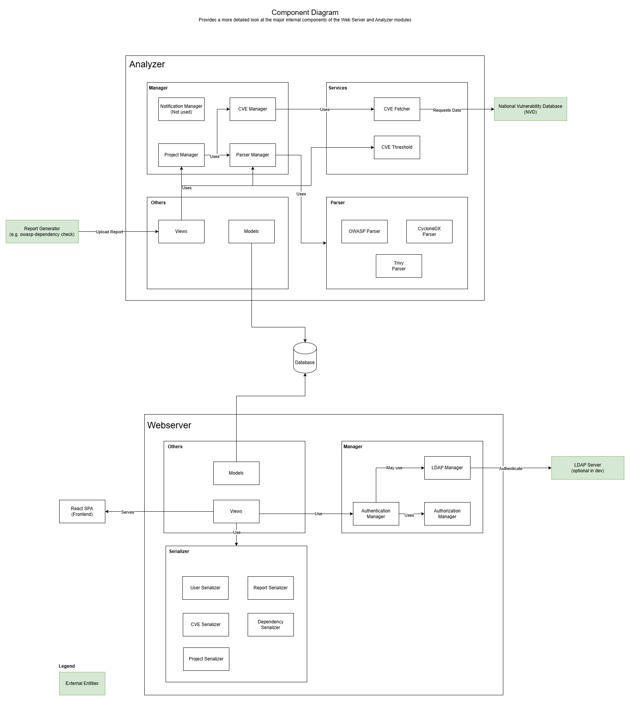

    

## Quick Overview for Developers

This Django-based web application serves as a tool to manage and track vulnerabilities in software dependencies. It utilizes a **React single-page frontend** integrated into the Django backend. The core features include report uploads, vulnerability tracking, project management, and notifications. Below is a concise introduction for developers to get started:

- **Frontend**: The single-page application is developed using **React** and served through Django. It provides an interactive interface for uploading reports, managing projects, and viewing vulnerabilities.
- **Backend**: The backend is powered by Django, which handles both API requests from the React frontend and core logic for managing vulnerabilities and user data.
- **Key Technologies**: Django (Backend and API server), React (Frontend), LDAP (Authentication) (optional, if used locally), and PostgreSQL (Database).

For more details about each module, continue reading the **Key Modules Overview** and **C4 Model Architecture** sections.

## Key Modules Overview

### Backend - Analyzer

- **Manager**:
  - `cve_manager.py`: Manages operations for CVEs, such as querying the database or external CVE sources.
  - `notification_manager.py`: Sends notifications to users based on vulnerability updates.
  - `parser_manager.py`: Orchestrates the parsing of vulnerability reports.
  - `project_manager.py`: Manages project-level data.
- **Parser**:
  - `cyclonedx_parser.py`, `owasp_parser.py`, `trivy_parser.py`: Handle the parsing logic for CycloneDX, OWASP Dependency Check, and Trivy reports respectively.
- **Services**:
  - `custom_parser_classes.py`: Defines custom parsing classes for reading in the body of requests.
  - `cve_fetcher.py`: Fetches CVE information from external sources.
  - `threshold_check.py`: Checks vulnerabilities against a defined threshold.

### Backend - Webserver

- **Manager**:
  - `authentication_manager.py`, `authorization_manager.py`: Handle authentication and role-based access.
  - `ldap_adapter.py`: Integrates LDAP for user management.
- **Views**:
  - `authentication_view.py`, `project_views.py`, `report_views.py`, `user_views.py`, `misc_views.py`: Define different endpoints to handle operations related to authentication, projects, reports, users, and miscellaneous tasks.
- **Serializer**: Serializes model data to JSON format for API responses and vice versa.

### Utilities

- Provides a set of utility functions, constants, and exception handlers used across the application for common tasks and reusable code.
  - `constants.py`: Defines application-wide constants.
  - `exceptions.py`: Custom exceptions used throughout the application.
  - `helperclass.py`: Utility functions used throughout the application.

## C4 Model Architecture

The architecture of this application can be visualized through the four layers of the C4 model: **Context**, **Container**, **Component**, and **Class**.

### 1. Context Diagram

The **Context Diagram** provides a high-level overview of how the system interacts with external entities:

- **Users**: Users interact with the application by uploading vulnerability reports, analyzing data, and managing projects.
- **External Systems**: The application integrates with external systems, including:
  - **OWASP Dependency Check**: Users can upload vulnerability reports from OWASP for analysis.
  - **LDAP**: Handles user authentication and role-based access.
  - **CVE Database**: Used for fetching detailed vulnerability information.

The webapp uses external systems to provide a webapp for users to manage and upload their reports and vulnerabilities.

### 2. Container Diagram

The **Container Diagram** depicts the core system containers of the application and their responsibilities:

- **React Frontend**: Provides an interactive user interface for uploading reports, managing projects, and viewing vulnerabilities.
- **Web Server (Django)**: Handles HTTP requests from users, serves the React frontend, and provides API endpoints for interaction.
- **Backend (Analyzer)**: Processes the uploaded vulnerability reports and manages core business logic such as parsing, notifications, and project management.
- **Database**: Stores data related to users, projects, dependencies, and vulnerabilities. For a more in-depth look into the schema of the database look at: [TODO] LINK
- **External Systems**:
  - **LDAP**: Responsible for authentication and authorization of users.
  - **CVE Database**: Provides up-to-date vulnerability information.

### 3. Component Diagram

The **Component Diagram** provides a more detailed look at the major internal components of the **Web Server** and **Analyzer** modules:

#### Analyzer Module

- **Manager**:
  - **CVE Manager**: Manages fetching of CVEs and stores them for project usage.
  - **Notification Manager**: Sends notifications to users when a vulnerability is found or updated.
  - **Project Manager**: Handles the management of project-level data, including linking vulnerabilities to specific projects.
- **Parser**:
  - **CycloneDX Parser**: Handles the parsing of CycloneDX format vulnerability reports.
  - **OWASP Parser**: Handles OWASP Dependency Check reports.
  - **Trivy Parser**: Parses Trivy vulnerability reports.
- **Services**:
  - **CVE Fetcher**: Fetches CVE details from external sources.
  - **Threshold Check**: Implements checks to determine if vulnerabilities exceed acceptable risk levels.

#### Webserver Module

- **Views**:
  - **Authentication Views**: Handles user login, logout, and registration.
  - **Project Views**: API endpoints for project management.
  - **Report Views**: Manages the upload and processing of vulnerability reports.
  - **User Views**: Manages user profile and access rights.
  - **Miscellaneous Views**: Handles other user actions.
- **Manager**:
  - **Authentication Manager**: Manages user login and registration.
  - **Authorization Manager**: Handles role-based access controls.
  - **LDAP Adapter**: Integrates with LDAP for user authentication and authorization.
- **Serializer**: Serializes data between Django models and JSON format for API communication.

### 4. Class Diagram (TODO?)