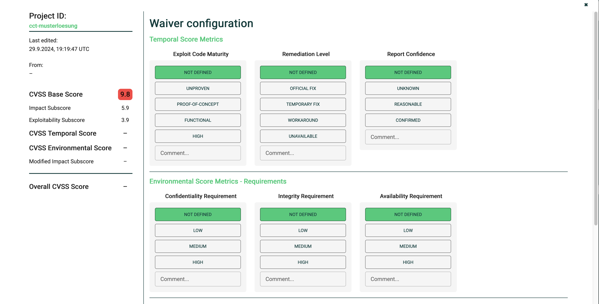

    

## Using the Web Frontend

### Login Page

Open a browser at [http://localhost:8080/](http://localhost:8080/) for a development installation of SecureCheckPlus.

    

There is no registration function. To log in, you need the preset credentials as defined the environment or as 
defined by LDAP server. The username is always the email address.

### Navigation Bars

If you log in for the first time, you will notice that no projects are displayed. 
This is because the page you are on after logging in only shows projects that you 
have recently accessed.

Simply go to Sidebar > Projects

Projects you have viewed are automatically added to "Recently."

### User Menu

The user menu is located in the top right corner.

    

### User Settings

This dialog contains user specific settings. 

    

The input field "Image Name" is just a gimmick and generates an avatar image based on the input 
(please do not use personal information).

The notification threshold determines the threat level at which you want to be informed via email.

**NOTE**: The email feature has not been released yet! See https://github.com/marcus67/SecureCheckPlus/issues/52.

*Example:* You have set your threat level to "High." A new project is uploaded via the CI process. 
You will only receive a notification if all the following criteria are met:

- You have marked the project as favorite (see below "Project Overview").
- The uploaded project has at least one vulnerability of type "High" or higher.
- There have been changes since the last upload of the project 
  regarding the detected vulnerabilities or dependencies.

### Project List

After logging in you will end up in the project list giving you an overview of all configured projects. Typical tasks
in the window include:

* Use the `Create` button to add a new project. See (1). This is for administrators only.
* Use the filter to narrow down the number of entries. See (2). The choices are: *Recent*: Projects will be sorted
  by the time of the most recent report upload. *Favorites*: Only display favorite projects. *All Projects*: Remove
  the filter and display all projects.
* Use the `Search Bar` field to search for projects by names. See (3).
* Use the star in the top left corner of a project entry to mark it as favorite. See (4). 
* Click anywhere of a project entry to open the [dashboard](#project-dashboard) of that project. See (5).
* Click on the checkboxes on in the left of the project entry to mark a project for deletion. See (6). Then use the 
 `Delete` button to delete all selected projects. See (7). This is for administrators only.
* Click on the user avatar in top right corner to change user settings or logout. See (8). 
* Use the sidebar menu (see (9)) to access 
  * this project list,
  * the data privacy statement of the application,
  * the imprint of the application,
  * the GitHub homepage of the application.

    

### Project Dashboard

The project dashboard show the overview of the status of a single product. See the table below for a description
of the elements. Use the browser back button or the `Project overview` breadcrumb to return to the project list.

    

| Number | Description                                                                                                                                                                     |
|--------|---------------------------------------------------------------------------------------------------------------------------------------------------------------------------------|
| 1      | Project ID                                                                                                                                                                      |
| 2      | Project Name. Will be `-` if no project name was given on creation.                                                                                                             | 
| 3      | Click to open a dialog for changing the [project settings](#project-settings).                                                                                                  | 
| 4      | Mark the project as favorite.                                                                                                                                                   |
| 5      | Time and date when the last project report was most recently updated.                                                                                                           | 
| 6      | Number of dependencies (such as Java libraries or Python packages) found in the scan report of the project.                                                                     |
| 7      | Total number of completed entries, including those of removed libraries.                                                                                                        |
| 8      | Number of reports that are in the status `Unevaluated` or `To be re-evaluated` (click to display the list).                                                                     |
| 9      | Number of reports classified as `Threat` or  `Threat - in progress` (click to display the list).                                                                                |
| 10     | Number of reports classified as `Resolved` or `No Threat` from active libraries (click to display the list).                                                                    |
| 11     | All numbers of the diagrams to the left and their ratio.                                                                                                                        |
| 12     | Legend for the categories of the respective chart. Click on a category to hide it.                                                                                              |
| 13     | Threat threshold at which the build pipeline should be stopped (at least one finding of the specified level). This can be changed in the [project settings](#project-settings). |

### Project Settings

**NOTE**: Admin rights are required for this dialog.

    

Use this dialog to

* change the name of the project (the project id cannot be changed after the project has been created),
* set the threat threshold of the project equal to or above which the pipeline will be terminated,
* generate an API key for the pipeline adapter.

#### Generate an API Key

Remember to save the dialog after generating an API key. Otherwise, the old API key will remain active. Also remember
that you will have to store the API key immediately since you will not be able to retrieve it again after closing the
dialog!

If the deployment threshold is set to "Critical," the deployment of the project will be stopped if at least one vulnerability of the "Critical" level or higher is present.

### Report Overview

The report overview shows a selection of vulnerabilities of the active project. The filter has implicitly been defined
by the click that took you here.

    

| Number | Description                                                                             |
|--------|-----------------------------------------------------------------------------------------|
| 1      | Filter reports by the threat status. See the [status model](#status-model) for details. |
| 2      | Filter reports by the severity `Critical`,  `High`,  `Medium`, `Low`,  `None`, `N/A`    |
| 3      | Filter reports by the library name/dependency name                                      |
| 4      | This is a report entry, by clicking you go to the respective report page.               |

By clicking on the individual entries, you are taken to the respective report. 
Different filters can be combined with each other.

The columns of the report overview have the following semantics:

| Column      | Description                                                                                                    |
|-------------|----------------------------------------------------------------------------------------------------------------|
| Open        | Use this link to go to specific vulnerability report                                                           |
| CVE ID      | Official unique id of the vulnerability as defined by [www.cve.org](https://www.cve.org/).                     |
| Dependency  | Unique id of the artifact that is affected by the CVE                                                          |
| Version     | Version of the artifact that is affected by the CVE                                                            |
| Status      | Threat status as defined by the user of SecureCheckPlus.  See the [status model](#status-model) for details.   |
| Severity    | Severity (group) of the CVE                                                                                    |
| Base        | Numerical severity as defined by www.cve.org.                                                                  |
| CVSS        | Modified numerical severity as defined by the user of SecureCheckPlus. See [CVSS Calculator](#cvss-calculator) |
| EPSS        | Numerical rating of the CVE in the [Exploit Prediction Scoring System](https://www.first.org/epss/)            |
| Description | Short description of the CVE                                                                                   |

#### Report Detail Page

The Report Detail Page shows an overview of exactly one vulnerability.

**NOTE**: Admin rights are required for updating (categorizing, suggesting a solution, and commenting).

    

| Number | Description                                                                                                                                                                                           | 
|--------|-------------------------------------------------------------------------------------------------------------------------------------------------------------------------------------------------------|
| 1      | Contains project ID, project name (if set), dependency name, version, and favorite button in the top left corner                                                                                      |
| 2      | Contains CVE ID, the time and date when this CVE was published, and the time and date when its most recent update was made.                                                                           |
| 3      | Shows the base severity score. The background color indicates the severity level.                                                                                                                     |
| 4      | Modified numerical severity as defined by the user of SecureCheckPlus.                                                                                                                                |
| 5      | Click this button to open the [CVSS Calculator](#cvss-calculator)                                                                                                                                     |
| 6      | The current threat status of this report.  See the [status model](#status-model) for details. Additionally, when and who last updated this report. `No author` denotes the initial scan report entry. |
| 7      | The properties of the vulnerability. See the [Common Vulnerability Scoring System](https://en.wikipedia.org/wiki/Common_Vulnerability_Scoring_System)                                                 |
| 8      | A solution can be proposed here, if the vulnerability is regarded as threat. An additional comment can be added.                                                                                      |
| 9      | Shows the modified CVSS 3.1 vector string, if the CVSS has been used to modify the CVSS attributes.                                                                                                   |
| 10     | Link to an external site that provides further information on this report. The `Vendor` button is only active, if a there is a specific vendor report available.                                      |
| 11     | To save the changes, you should press save.                                                                                                                                                           |

If the meaning of the vulnerability properties is not entirely clear, you can look up the exact definitions here.

### Status Model

The status provides information about the current processing status of the threat. A new threat is set with the 
status `To be evaluated.` From there, the status goes through a series of steps, which are shown in the following 
graphic.

If the status is set to `Threat` the solution will have to chosen as of the following options

| Solution                | Description                                                                                                    | 
|-------------------------|----------------------------------------------------------------------------------------------------------------|
| `Change version`        | Change (usually upgrade) the version of the artifact, since this version is not affected by the vulnerability. |
| `Change dependency`     | Replace the artifact by another one, e.g. exchange a Java library by another functionally equivalent one.      |
| `Programming`           | Modify the use of the library in such a way so that the attack vector of the vulnerability no longer applies.  |
| `No solution available` | Currently, there is no solution available.                                                                     |

    

### CVSS Calculator

The CVSS calculator can be used to re-calculate the effective severity of a vulnerability by choosing different values
for the CVSS criteria which are based on the specific assessment of the attack vector. The metrics which were defined
by [www.cve.org](https://www.cve.org/) are pre-selected in the calculator in the section `Environmental Score Metrics`.
They can be changed by the user. The metrics in the section `Temporal Score Metrics` and `Environmental Score Metrics`
can also be adapted. The overall CVSS score will automatically be updated after each change.

    

    

