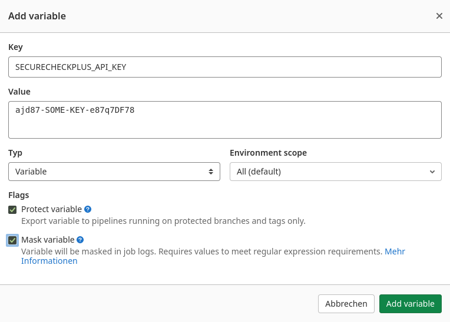

    

# Adapter Setup for GitLab CI

## Definition of the Stages

Add two stages to the existing pipeline file `.gitlab-ci.yml`. There are templates 
available for the [scan](stage-owasp-scan.yml) and 
[upload](stage-upload-owasp-report.yml) stages. You may have to rename the job names
if there are collisions with the other jobs in the pipeline.

## List of the CI Variables

The following variables are used by the stage templates:

* `SECURECHECKPLUS_SERVER_URL`
* `SECURECHECKPLUS_PROJECT_ID`
* `SECURECHECKPLUS_API_KEY`
* `SECURECHECKPLUS_SKIP`

## Setting Variables in GitLab

- Go to the repository of the project you want to analyze.
- Navigate to "Settings" => "CI/CD" => "Variables (Expand)" => "Add variable".
  

    

- Enter `SECURECHECKPLUS_SERVER_URL` as the key. If using a different key, make sure 
  to adapt the templates accordingly.
- For the value, input the API key.
- Repeat the steps for all variables listed above. 

**NOTE**: Make sure that you protect and mask the API key!
